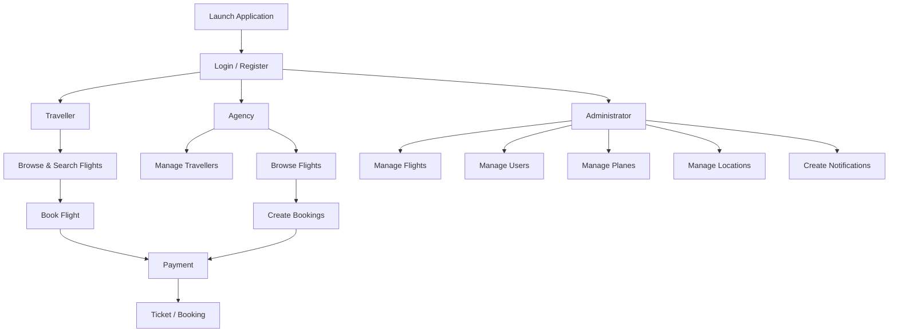
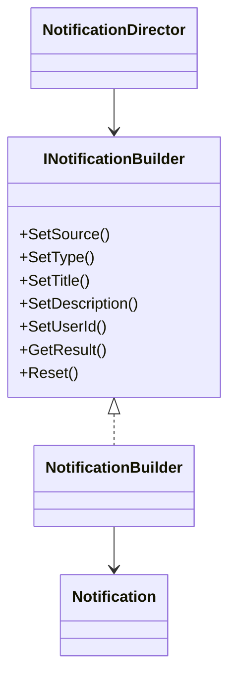
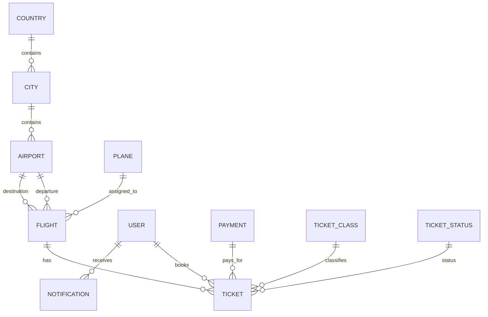

<div align="center">

# Happy Journey Airline

### Desktop airline booking and management system built with C# and Windows Forms

A multi-role airline management application for travellers, travel agencies, and administrators, backed by SQL Server LocalDB.


</div>

---

## Overview

**Happy Journey Airline** is a Windows desktop application for managing airline operations through separate Traveller, Agency, and Administrator experiences.

The system supports the complete flow from browsing flights and booking tickets to processing payments, managing travellers, maintaining flights and aircraft, and sending user notifications.

The project was developed for **IT7006 – Object Oriented Design** and applies object-oriented principles and design patterns throughout the application.

---

## User Roles

The application provides three role-specific experiences:

### Traveller

Travellers can:

* Register and log in
* Browse available flights
* Search and filter flights
* View flight details
* Book flights
* Select ticket classes
* Complete payments
* View existing bookings
* View booking details
* Cancel bookings
* Receive notifications
* Update account information
* Delete their account

### Agency

Travel agencies can manage bookings on behalf of travellers.

Agency functionality includes:

* Browse available flights
* View agency bookings
* View travellers assigned to flights
* Add travellers to flights
* Remove travellers from flights
* Create traveller accounts
* Process payments
* Pay for multiple travellers
* View notifications
* Manage agency account information

### Administrator

Administrators can manage the wider airline system, including:

* Users
* Flights
* Planes
* Airports
* Cities
* Countries
* Bookings
* Notifications
* System data

Administrators can also create and edit flights, manage location information, create users, and back up the local database.

---

## Application Flow



---

## Flight Booking

Travellers can browse the available flights and narrow the results using flight information such as:

* Departure location
* Arrival location
* Date
* Time

Selecting a flight opens its details and allows the traveller to continue into the booking and payment process.

Bookings connect:

* A traveller
* A flight
* A ticket class
* A ticket status
* A payment
* An optional travel agency

---

## Payments

The system stores payment information separately from tickets.

Supported payment UI options include:

* Visa
* American Express
* Credit card

Payment records contain:

* Amount
* Date
* Payment status
* Payment method

Travel agencies can also process payments for travellers they manage.

---

## Notifications

Happy Journey Airline includes a database-backed notification system.

Notifications contain information such as:

* Source
* Type
* Title
* Description
* Recipient

The project uses the **Builder design pattern** to construct notifications.



The `NotificationDirector` provides predefined construction flows for:

```text
Alert
Important
Marketing
```

For example, the director can construct an alert notification while the builder handles the individual notification fields and persistence.

---

## Design Patterns

The project was created for an Object Oriented Design course and contains explicit implementations of design patterns.

### Singleton Pattern

Database access is centralized through:

```text
Lib/Database.cs
```

The `Database` class exposes a single shared instance:

```csharp
Database.Instance
```

and provides reusable methods for:

* Queries
* Parameterized queries
* INSERT / UPDATE / DELETE commands
* Database backups

Thread-safe initialization is implemented using a lock around the singleton instance creation.

### Builder Pattern

Notifications are created through:

```text
BuilderPattern/
├── INotificationBuilder.cs
├── NotificationBuilder.cs
└── NotificationDirector.cs
```

This separates notification construction from the notification model itself.

---

## Data Access

The application communicates directly with SQL Server using:

```text
System.Data.SqlClient
```

Rather than using an ORM, the model classes contain explicit SQL operations for retrieving and modifying their corresponding data.

The shared `Database` class provides generic helpers for executing parameterized queries.

Example domain operations include:

```text
GetAllFlights()
GetFlightById()
AddFlight()
UpdateFlight()
DeleteFlight()

GetAllUsers()
GetUserById()
AddUser()
UpdateUser()
DeleteUser()

GetAllTickets()
AddTicket()
UpdateTicket()
DeleteTicket()
```

---

## Data Model

The application contains models for:

```text
Airport
City
Country
Flight
FlightStatus
Notification
Payment
PaymentMethod
PaymentStatus
Plane
Ticket
TicketClass
TicketStatus
User
```

A simplified relationship view:



---

## Authentication & Sessions

Users authenticate using their username and password.

After successful login, the application stores the current user's ID locally through `AuthService`.

The saved session allows the application to restore the correct dashboard when it starts again.

Supported user types are:

```text
traveller
agency
admin
```

> This authentication approach was designed for an academic desktop application and should not be treated as production-grade authentication.

---

## Architecture

```text
HappyJourneyAirline/
├── BuilderPattern/
│   ├── INotificationBuilder.cs
│   ├── NotificationBuilder.cs
│   └── NotificationDirector.cs
│
├── Lib/
│   ├── AuthService.cs
│   └── Database.cs
│
├── Models/
│   ├── Airport.cs
│   ├── City.cs
│   ├── Country.cs
│   ├── Flight.cs
│   ├── FlightStatus.cs
│   ├── Notification.cs
│   ├── Payment.cs
│   ├── PaymentMethod.cs
│   ├── PaymentStatus.cs
│   ├── Plane.cs
│   ├── Ticket.cs
│   ├── TicketClass.cs
│   ├── TicketStatus.cs
│   └── User.cs
│
├── Tabs/
│   ├── AdminTabs.cs
│   ├── EmployerTabs.cs
│   └── TravellerTabs.cs
│
├── Resources/
├── App.cs
├── MainAppUI.cs
├── database.mdf
└── HappyJourneyAirline.csproj
```

### `Models`

Contains the application's domain models and their SQL-based persistence operations.

### `Lib`

Contains shared infrastructure for database access and user-session management.

### `Tabs`

Contains the role-specific Windows Forms interfaces.

`EmployerTabs` represents the application's travel-agency interface.

### `BuilderPattern`

Contains the notification Builder-pattern implementation.

---

## Technology Stack

| Area                | Technology                          |
| ------------------- | ----------------------------------- |
| Language            | C#                                  |
| Runtime             | .NET Framework 4.7.2                |
| UI                  | Windows Forms                       |
| Database            | SQL Server LocalDB                  |
| Data Access         | System.Data.SqlClient               |
| IDE                 | Visual Studio                       |
| Architecture        | Object-oriented desktop application |
| Design Patterns     | Singleton, Builder                  |
| Session Persistence | Local file                          |
| Database Storage    | `.mdf` / `.ldf`                     |

---

## Getting Started

### Requirements

You will need:

* Windows
* Visual Studio 2022
* .NET Framework 4.7.2 targeting pack
* SQL Server Express LocalDB

### 1. Clone the Repository

```bash
git clone https://github.com/memezsxz/Happy-Journey-Airline.git
cd Happy-Journey-Airline
```

### 2. Open the Solution

Open:

```text
HappyJourneyAirline.sln
```

in Visual Studio.

### 3. Database

The repository includes:

```text
HappyJourneyAirline/database.mdf
HappyJourneyAirline/database_log.ldf
```

The project is currently configured to connect to the database using SQL Server LocalDB:

```text
Data Source=(localdb)\MSSQLLocalDB;
Initial Catalog=|DataDirectory|\database.mdf;
Integrated Security=True;
```

The database files are configured to be copied into the application's output directory during the build.

If LocalDB is installed correctly, no external database server should be required.

### 4. Build

In Visual Studio:

```text
Build → Build Solution
```

### 5. Run

Start the `HappyJourneyAirline` project.

The application opens the main interface containing the login and registration flow.

---

## Demo Accounts

The included database contains accounts for each application role.

### Traveller

```text
Username: hassan_traveller
Password: 123456
```

### Agency

```text
Username: khalid_agency
Password: 123456
```

### Administrator

```text
Username: fatima_admin
Password: 123456
```

These accounts can be used to explore the different role-specific interfaces.

---

## Database Backup

Administrators can trigger a backup of the application's SQL Server database.

The database helper executes a SQL Server:

```sql
BACKUP DATABASE
```

command and writes the resulting `.bak` file to the selected location.

---

## Team

Happy Journey Airline was developed as a four-person project by:

* Hussain Sabba
* Maryam Ali
* Fatima Hasan
* Ahmed Ali

**Course:** IT7006 – Object Oriented Design
**Instructor:** Dr. Faustino Reyes

---

## Project Status

Happy Journey Airline is a **completed academic desktop application**.

The project demonstrates:

* C# desktop development
* Windows Forms
* SQL database integration
* Object-oriented modelling
* Multi-role application design
* Authentication and sessions
* Airline booking workflows
* Design-pattern implementation
* Direct SQL data access
* CRUD operations
